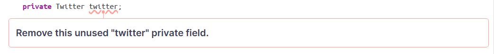

# PROJECT Design Documentation

## Team Information
* Team name: JHCJ
* Team members
  * Jaden Jovanelly
  * JC Mve Mvondo
  * Hakan Gul
  * Christian Isaacs

## Executive Summary

Our U Fund provides a groundbreaking initiative designed to bridge the technological divide by providing funding and resources to individuals who lack access to essential technology. In an era where digital literacy is pivotal, the project aims to empower marginalized communities by ensuring they have the tools and skills needed to thrive in the modern world.

### Purpose
The primary goal of our fund is to democratize access to technology, thereby fostering inclusivity and equal opportunities. By leveraging these resources, the project seeks to develop scalable and user-friendly applications that can be deployed across various devices, making technology accessible to a wide range of users within our target audience.

### Glossary and Acronyms

| Term                   | Definition                                   |
|------------------------|----------------------------------------------|
| SPA                    | Single Page                                  |
| Manager                | Admin user (seeks funds)                     |
| Helper                 | Standard user (gives funds)                  |
| Funding Basket         | Stores needs that helper wishes to fund      |
| Cupoard                | Stores needs that need funding               |
| Need                   | A cause that requires funding                |

## Requirements

Features of the application:

The most relevant features of the application include being able to login as either an admin or helper. Helpers can manage a funding basket and fund needs, while the admin can manage a cupboard of needs that require funding. The application also includes the ability to promote a need on twitter (10% feature enhancement).

### Definition of MVP
The Minimum Viable Product is a version of a product that has just enough features for the user to interact with and give feedback on. This product is debuted early on in the design process for owners to receive feedback and enchance their product further with stories and epics.

### MVP Features
| Epic: Minimal Authentication |
|------------------------------|
|      -Helper Login           |
|      -Manager Login          |

| Epic: Manager Functionality      |
|----------------------------------|
|      -Add needs to cupboard      |
|      -Remove needs from cupboard |
|      -Edit needs in cupboard     |

|Epic: Helper Functionality        |
|----------------------------------|
|    -Search for needs             |
|    -Add needs to funding basket  |
|-Remove needs from funding basket |
|    -Checkout needs               |

### Enhancements
Epic: Tweet Needs

The enhancement for the application is a tweet feature using the popular social media platform twitter. When in their basket helpers will see a button to promote needs they want to fund. This buttons will post the need to their twitter account so that other helpers can see the need.

## Application Domain

This section describes the application domain.

The Domain Model designed for our U-Fund can be seen above. The Model provides a broken down overview of what can be expected when viewing all aspects of the fund, including the backend, frontend, etc... The origin box, "U Fund" is the nucleus of the entire project. All things connect to the fund as it is the project as a whole. Users and Orginizations keep the U fund afloat as they are the customers that interact with the application the most. All needs are displayed for both the Users and the Orginizations in the model including checkout, cupboard and funding baskets. 

## Architecture and Design

This section describes the application architecture.

### Summary

The following Tiers/Layers model shows a high-level view of the webapp's architecture. 

The web application, is built using the Model–View–ViewModel (MVVM) architecture pattern. 

The Model stores the application data objects including any functionality to provide persistance. 

The View is the client-side SPA built with Angular utilizing HTML, CSS and TypeScript. The ViewModel provides RESTful APIs to the client (View) as well as any logic required to manipulate the data objects from the Model.

Both the ViewModel and Model are built using Java and Spring Framework. Details of the components within these tiers are supplied below.

### Overview of User Interface

This section describes the web interface flow; this is how the user views and interacts with the web application. This application's user-interface is designed to be appealing to the eye. We went for a look that was both eye catching and alleviating which we thought was essential in a society that promotes the need for over the top UI design. Though we didnt spend too much time on the front end's look while trying to flesh out back end issues, we are still happy with how the prototype turned out. As a user I can log in as either a helper or admin in the login page. Once logged in I can see a dashboard unique to my account that displays areas such as a cupboard, a funding basket, a search bar. I can also see various buttons that provide functionality such as checkout and logout. This view varies with which type of user I am signed in as (helper/admin).

### View Tier
The View tier is the architecture that makes up the user-interface(UI) for the application, hence it is only front-end code. The UI consists of the following components.

These components make up the UI layout. They display various buttons and pages such as the home page with login/logout buttons,  a needs list & search bar, a funding basket & checkout page for helpers, a cupboard page for managers, and buttons to add, remove, edit, and share needs. The view tier is essential as it displays all the content to the user and establishes the flow of the application. Two sequence diagrams are shown, they each display a different action that a user can do within the UI.

 The first sequence diagram, shown below, illustrates the process of a user logging in to the application.

The next sequence diagram, shown below, illustrates the process of a helper checking out the needs in their funding basket.

These are just a few of the many actions displayed in the UI. This concludes the View Tier.

### ViewModel Tier
The ViewModel Tier is the architecture that exists between the View and the Model tiers. It "links" them together controlling any actions that exist between them. This tier consists of front-end and back-end code. The back-end code is controller classes that handle all of the logic for user actions. The front-end code is service classes that integrate these actions into the UI. A UML diagram of the ViewModel Tier is shown below.

### Model Tier
The Model Tier is the central tier of the architecture. User's use the controller to manipulate the model which then updates the view. The model tier consists of model classes for functionality and DAO classes for file persistance/storage. A UML diagram of the Model Tier is shown below.

## OO Design Principles
1. The Law of Demeter, also known as the principle of least knowledge, is another software design principle that states that objects should not “reach through” one another to access different methods. This principle is employed throughout our program, which has multiple components. One marker of the Law of Demeter is that we create objects and use their attributes for functions, rather than passing them through and calling upon pre-made objects. This means that the code is dynamic and can accept many instances of differing objects that can be worked with. Furthermore, only specialized methods are able to reference and use those objects for actions, which supports the no-trust principle within the Law of Demeter. Each method does not assume what the object passing into it is, and instead throws out anything that isn’t what is specified. This leads to loose coupling throughout the project.

2. The Open/Closed principle is a software design principle that emphasizes the importance of keeping software entities open for extension but closed for modification. In our domain model, this principle is evident in the handler classes and functions. Once these classes are set, there is no need to modify them. Instead, the Helper and Fund Manager classes can be modified using these functions/classes.

3. The Single Responsibility principle is another software design principle that states that a module should be responsible for one and only one actor. In our project, we ensured that every component was separate and had one job. For instance, instead of having authentication, routing, and design take place in the login component, we added services and guards to ensure that each component had only one task. This helped to create higher cohesion in the project and less coupling.

4. The controller, in object-oriented design is a module that exists between the view and the model. Contollers listens to events triggered by the view and execute the appropriate reaction to these events. In our project, we used two controllers, a cupboard controller that handles any event involving the cupboard/needs in it and a user controller that handles actions from the user. For example if a manager were to add or remove a need from the cubpoard this would be handled by the cupboard controller. On the other hand if a use, helper or manager, were to login to the application this would be handled by the user controller. 

## Static Code Analysis/Future Design Improvements
A static code analysis was performed on  our project. The results of the analysis are shown below.

Our code had a few consistency and adaptability smells but our primary issue was intentionality. To be intentional code must be precise and purposeful, our application had various cases of non-intentional code. Some specific areas are shown below.

Most of the intentionality issues are related to unrefactored code. They could be fixed by simply cleaning up the code a bit. For example, we had a lot of commented out code, unused code, and unused imports. These can all be removed to improve efficiency. We also had a lot of cases of uncecessary multi-threading, meaning we were not using static instances when we should of been.

If our team had additional time we would consdier making various improvements to our application. First, we would want to improve the UI. Our front end-was pretty basic and could be more eye-catching. Next, we would fix the issues caught by the static code analysis and refactor our code to improve maintainability / efficiency. Lastly, we would consider adding more enhancements to make our application unique and more functional.

## Testing
Testing for the application was done both manually (Accpetance Testing) and with test classes / Jacoco (Unit Testing).

### Acceptance Testing
All user stories passed acceptance testing. The application meets the required MVP features and our enhancement is also functional.

### Unit Testing and Code Coverage

Our team attempted to acheive an overall code coverage of around 90%. We selected this target as it earns full credit in the sprint rubric. For each class in the back-end we made respective test classes. In the test classes we created various test cases to assert the correctness of each function. 

The code coverage was pretty thorough,  we met a total of 90%. We did not make test cases for some classes so this brought our overall coverage down but the classes we did unit test have excellent coverage.
